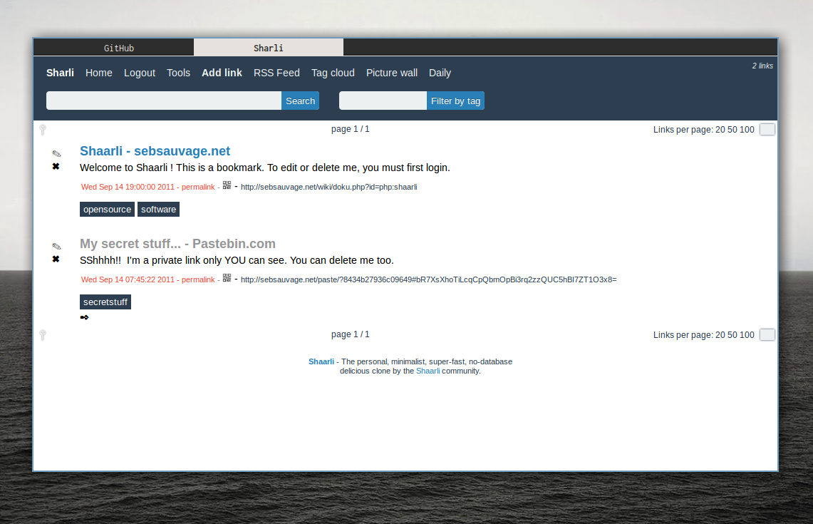

# Serious Theme for Shaarli

This is a serious and simple theme for [Shaarli](https://github.com/shaarli/Shaarli), a free software, minimalist bookmark sharing site.

You can use the [DejaVu Sans Light](http://dejavu-fonts.org/wiki/Main_Page) font (found on most GNU/Linux distributions) if you'd like your Daily Shaarli to look nice.

The theme should work fine in Shaarli upstream, but when using [my fork](https://github.com/mrjovanovic/Shaarli) it has the following benefits:

* It uses Unicode characters instead of icons for different functions (private, edit, delete)
* The text "Shaare your links" has been removed.
* The Daily Shaarli has a cleaner look.

I'll be updating the theme periodically as I go along. I am not exactly happy with it yet.

## Screenshots

Using my fork:

## License
The theme is licensed under the Affero GPL v.3
<https://gnu.org/licenses/agpl.html>
